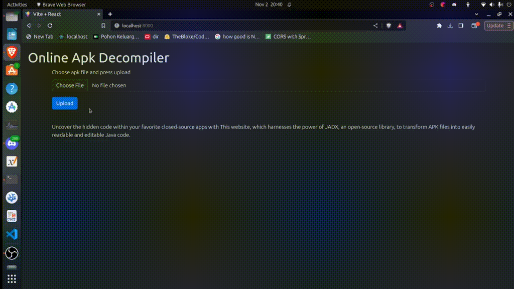

# Online Decompiler

## decompile apk in one click in a website 
decompile closed source apk back into java code



## Techstack
### Frontend 
- [Reactjs](https://react.dev/)

### Backend 
- [Spring Boot](https://spring.io/projects/spring-boot), [JADX](https://github.com/skylot/jadx)

### Database
- [mongodb](https://www.mongodb.com/)

## Running

after running command below

open http://localhost:8000/ to open the web app
### Docker


```sh
docker-compose up
```

fresh install [without cache](https://stackoverflow.com/a/44152540/14073678)
```sh
docker-compose down && docker-compose build --no-cache && docker-compose up
```

### Locally

start mongodb (ubuntu)

```sh
sudo systemctl start mongod

```
https://www.mongodb.com/docs/manual/tutorial/install-mongodb-on-ubuntu/

run the backend 

```sh
cd backend
gradle bootrun
```

run the frontend 

```sh
cd frontend
npm run dev
```
